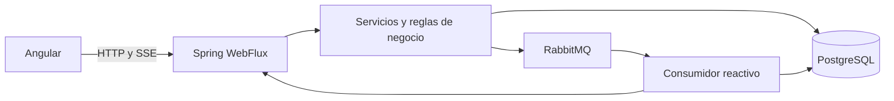
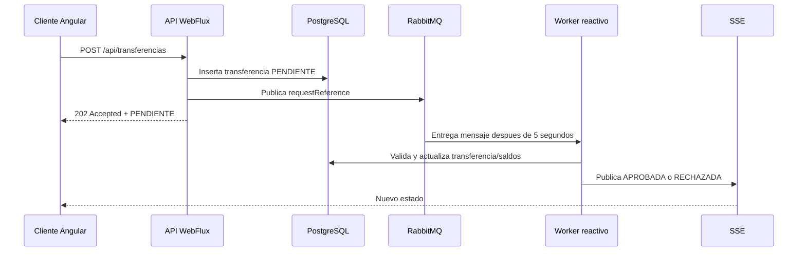

# IAS - Transferencias bancarias

Aplicacion bancaria de ejemplo para consultar cuentas y registrar transferencias con procesamiento asincrono. El workspace contiene un backend reactivo con Spring WebFlux/R2DBC y un frontend Angular.

## Arquitectura



Componentes:

- `ias`: backend Spring Boot 3.3.4 con Java 21.
- `iasFrontCuenta`: frontend Angular standalone.
- `docker-compose.yml`: PostgreSQL y RabbitMQ para desarrollo local.

## Tecnologias

### Backend

- Java 21.
- Spring Boot 3.3.4.
- Spring WebFlux.
- Project Reactor (`Mono` y `Flux`).
- Spring Data R2DBC.
- PostgreSQL 16.
- Reactor RabbitMQ.
- SpringDoc OpenAPI.

### Frontend

- Angular 20.
- Angular Material.
- Componentes standalone.
- Signals y lazy loading.
- `HttpClient` para REST.
- `EventSource` para eventos SSE.

## Persistencia

El backend utiliza exclusivamente R2DBC. No utiliza JPA, Hibernate, JDBC ni repositorios en memoria.

Las tablas se crean desde:

- `ias/src/main/resources/schema.sql`
- `ias/src/main/resources/data.sql`

Tablas principales:

- `cuentas`: cuentas bancarias, saldo, moneda y limite diario.
- `transferencias`: solicitudes, estado, resultado, observacion y fechas.

La referencia `request_reference` tiene una restriccion `UNIQUE` para impedir duplicados.

## Procesamiento de transferencias

El registro es asincrono:



Estados posibles:

- `PENDIENTE`: recibida y esperando procesamiento.
- `APROBADA`: reglas, saldo y limite validados.
- `RECHAZADA`: alguna regla de negocio no se cumple.
- `DUPLICADA`: estado legado; las solicitudes repetidas ahora reutilizan la transferencia existente.

Una transferencia aprobada:

1. Debita la cuenta origen.
2. Acredita la cuenta destino.
3. Actualiza la transferencia.
4. Ejecuta estas operaciones dentro de una transaccion R2DBC.

El consumidor confirma el mensaje RabbitMQ solo despues de completar el procesamiento.

## Idempotencia

La idempotencia se basa en `requestReference`:

- La insercion usa `ON CONFLICT (request_reference) DO NOTHING`.
- Dos solicitudes simultaneas con el mismo payload reutilizan la misma transferencia.
- La misma referencia con origen, destino, monto o moneda diferentes devuelve `409 Conflict`.
- No se crea una segunda fila para representar una duplicada.

## API

### Listar transferencias

```http
GET http://localhost:8080/api/transferencias
```

### Consultar por referencia

```http
GET http://localhost:8080/api/transferencias/request/{requestReference}
```

### Consultar historial por cuenta

```http
GET http://localhost:8080/api/transferencias/cuenta/{numeroCuenta}
```

### Registrar transferencia

```http
POST http://localhost:8080/api/transferencias
Content-Type: application/json
```

Ejemplo:

```json
{
  "requestReference": "REF-001",
  "sourceAccountId": "CTA-1001",
  "destinationAccountId": "CTA-1002",
  "amount": 100000,
  "currency": "COP"
}
```

Respuesta inicial:

```json
{
  "requestReference": "REF-001",
  "estado": "PENDIENTE",
  "resultado": "PENDIENTE"
}
```

El endpoint responde `202 Accepted`.

### Escuchar cambios de estado

```http
GET http://localhost:8080/api/transferencias/request/{requestReference}/eventos
Accept: text/event-stream
```

El servidor envia el DTO actualizado cuando la transferencia cambia a `APROBADA` o `RECHAZADA`.

### Cuentas

```http
GET http://localhost:8080/api/cuentas
GET http://localhost:8080/api/cuentas/{numeroCuenta}
```

## Frontend

El frontend se encuentra en `iasFrontCuenta`.

Funcionalidades:

- Listado de cuentas.
- Consulta de cuenta por numero.
- Registro de transferencias.
- Visualizacion inmediata del estado `PENDIENTE`.
- Actualizacion automatica por SSE.
- Consulta por referencia.
- Historial de movimientos por cuenta.
- Listado general de transferencias.

La URL del backend se configura en:

- `iasFrontCuenta/src/environments/environment.ts`
- `iasFrontCuenta/src/environments/environment.production.ts`

## Requisitos

- Java 21.
- Maven Wrapper incluido en `ias/mvnw` y `ias/mvnw.cmd`.
- Node.js y npm.
- Docker Desktop con Docker Compose.

## Configuracion local

Valores por defecto del backend:

| Variable | Valor por defecto |
|---|---|
| `DB_URL` | `r2dbc:postgresql://localhost:5432/iasdb` |
| `DB_USERNAME` | `ias` |
| `DB_PASSWORD` | `ias` |
| `RABBITMQ_HOST` | `localhost` |
| `RABBITMQ_PORT` | `5672` |
| `RABBITMQ_USERNAME` | `ias` |
| `RABBITMQ_PASSWORD` | `ias` |
| `IAS_RABBITMQ_QUEUE` | `transferencias.pendientes` |

Para otro ambiente se recomienda configurar estas variables fuera del repositorio.

## Arranque

### 1. Levantar infraestructura

Desde la raiz del workspace:

```bash
docker compose up -d
```

Servicios:

- PostgreSQL: `localhost:5432`.
- RabbitMQ AMQP: `localhost:5672`.
- Panel RabbitMQ: `http://localhost:15672`.
- Usuario RabbitMQ: `ias`.
- Contrasena RabbitMQ: `ias`.

### 2. Iniciar backend

En otra terminal:

```bash
cd ias
./mvnw spring-boot:run
```

En Windows:

```powershell
cd ias
./mvnw.cmd spring-boot:run
```

Endpoints utiles:

- API: `http://localhost:8080`.
- Swagger UI: `http://localhost:8080/swagger-ui.html`.
- OpenAPI: `http://localhost:8080/v3/api-docs`.

### 3. Iniciar frontend

```bash
cd iasFrontCuenta
npm install
npm start
```

Abrir `http://localhost:4200`.

## Transacciones

El bean `R2dbcTransactionManager` y `TransactionalOperator` garantizan que una transferencia aprobada actualice de forma atomica:

- Registro de transferencia.
- Debito de origen.
- Credito de destino.

Si una operacion falla, la transaccion se revierte.

## Consideraciones actuales

- RabbitMQ es el mecanismo de procesamiento diferido y el mensaje queda persistido en la cola.
- El estado de la transferencia permanece en PostgreSQL.
- El patrón Outbox está implementado: la transferencia y el evento se guardan juntos en PostgreSQL; un publicador reactivo reintenta eventos `PENDING` y los marca `PUBLISHED` después de enviarlos a RabbitMQ.
- Para evitar condiciones de carrera financieras, los debitos y creditos deben evolucionar a `UPDATE` SQL atomicos con condiciones de saldo. La transaccion por si sola no sustituye el bloqueo o la actualizacion condicional.
- Para produccion se recomienda reemplazar `schema.sql` por migraciones versionadas con Flyway o Liquibase.
- No se deben usar las credenciales incluidas en Compose en ambientes productivos.

## Estructura resumida

```text
ias/
├── src/main/java/com/banco/ias
│   ├── api/controller
│   ├── business/rules
│   ├── business/service
│   ├── core/config
│   ├── core/exception
│   ├── domain/dto
│   ├── domain/model
│   ├── domain/repository
│   └── persistence
├── src/main/resources
│   ├── application.properties
│   ├── data.sql
│   └── schema.sql
└── pom.xml

iasFrontCuenta/
└── src/app/features
    ├── cuentas
    └── transferencias
```
